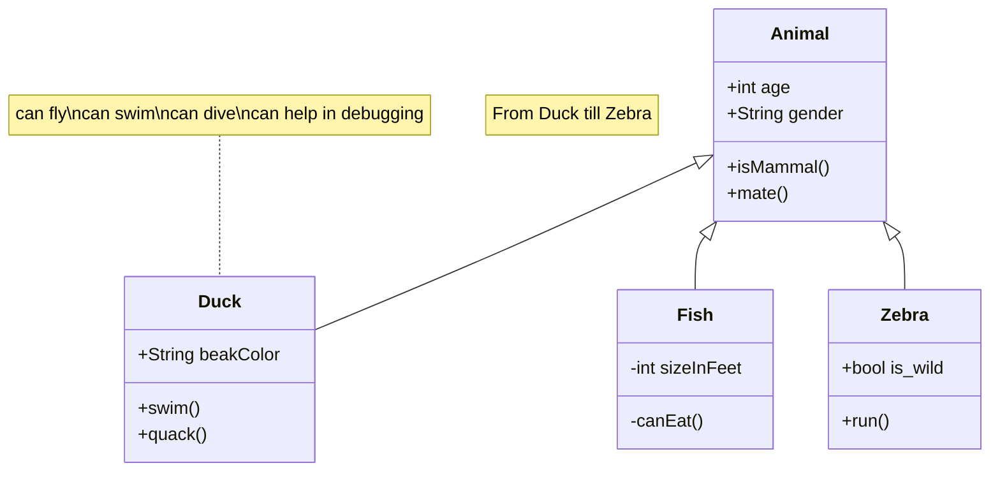

`Club` (<ins>numClub</ins>, nomClub, adresse,numTelephone, nombreAdherents, ville, departement, region)
`Utilisateur` (<ins>numUtilisateur</ins>, nom, prenom, age, adresse, login,motDePasse, numClub *)
`Président` (<ins>numPresident *</ins>, prime)
`Evaluateur` (<ins>numEvaluateur *</ins>, specialite)
`Competiteur` (<ins>numCompetiteur *</ins>, datePremParticipation)
`Administrateur` (<ins>numAdministrateur *</ins>, dateDebut)
`Directeur` (<ins>numDirecteur *</ins>, dateDebut)
`Dirige` (<ins>numClub *</ins>, <ins>numDirecteur *</ins>)
`Concours` (<ins>numConcours</ins>, theme, descriptif, dateDebut, dateFin, etat, numPresident *)
`Participe_club` (<ins>numClub *</ins>, <ins>numConcours *</ins>)
`Partitipe_competiteur` (<ins>numCompetiteur *</ins>, <ins>numConcours *</ins>)
`Dessin` (<ins>numDessin</ins>, commentaire, classement, dateRemise, leDessin, numConcours *, numCompetiteur *)
`Evaluation` (<ins>numDessin *</ins>, <ins>numEvaluateur *</ins>, <ins>dateEvaluation</ins>, note, commentaire)
`Jury` (<ins>numConcours *</ins>, <ins>numEvaluateur *</ins>)

